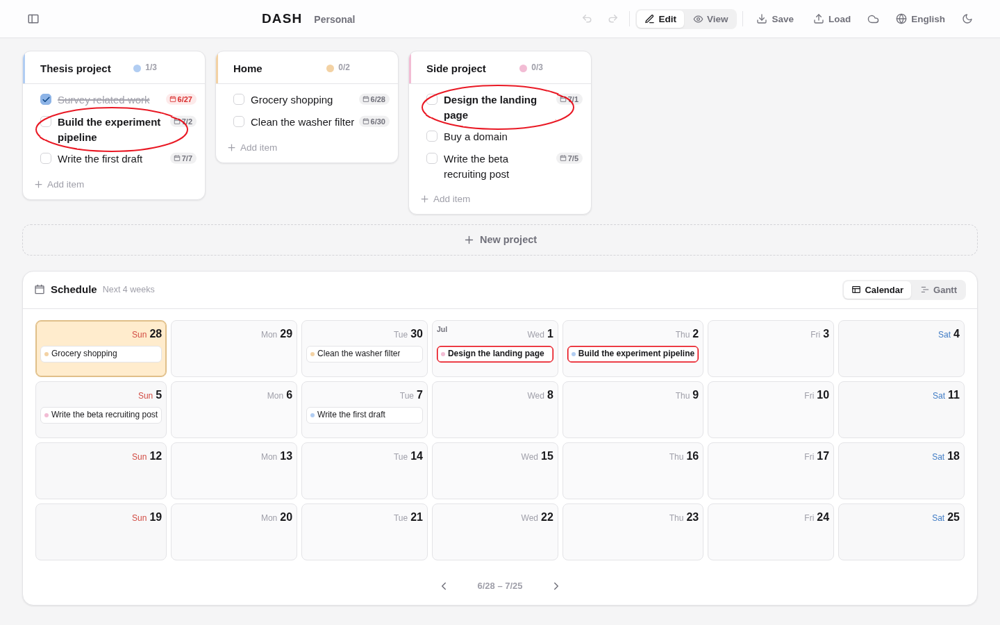

# DASH — Daily Agenda & Schedule Hub


**A **lightweight, simple** personal schedule dashboard**

Group your tasks into project boxes, then read all their deadlines at a glance on
the timeline below — as a **4‑week calendar** or a **2‑week Gantt chart**. 
It runs entirely in the browser with no backend; data is saved automatically and can be
exported to / imported from a JSON file.


## Features

- **Project boxes + to‑do lists** — a simple "box holds a list" structure (not a kanban board)
- **Three item states** — default · done (strikethrough) · highlight (bold + a hand‑drawn red "grading" circle)
- **Minimal‑click interactions** — hover an item and the complete / highlight / due‑date / delete buttons pop up right over it
- **Drag to reorder** — grab the handle to move boxes and items, including between lists
- **Multiple boards** — keep separate boards (work, home, side‑project…) and switch from the left drawer
- **Timeline** — a 4‑week calendar or 2‑week Gantt chart; page back/forward with the arrows below it
- **Due dates & ranges** — a mini calendar where a click sets a single day and a drag sets a span
- **Undo / redo** — `Ctrl/⌘ + Z` and `Ctrl/⌘ + Y` (rapid edits are coalesced into one step)
- **Edit mode / View mode** — flip to a clean, read‑only view
- **Bilingual UI** — Korean ↔ English, remembered across visits
- **Autosave + export/import** — `localStorage` autosave, JSON backup you can move between devices
- **Optional cross‑device sync** — connect a private GitHub Gist to keep all boards in sync across devices, auto‑pulling other devices' changes (no backend)
- **Responsive · mobile · dark mode** — works on any screen

## Getting started

```bash
npm install
npm run dev      # http://127.0.0.1:5180
```

Production build:

```bash
npm run build    # outputs to dist/
npm run preview  # preview the built output
```

## Tech stack

[Svelte 5](https://svelte.dev) + [Vite](https://vitejs.dev), with drag‑and‑drop by
[svelte-dnd-action](https://github.com/isaacHagoel/svelte-dnd-action). Runtime
dependencies are kept to a minimum, so the bundle stays small (~40 KB gzipped).

## Deployment

DASH is a fully static single‑page app, so any static host works. Pick one:

### GitHub Pages (recommended)

A workflow is included at [`.github/workflows/deploy.yml`](.github/workflows/deploy.yml).
Enable Pages once, then every push to `main` builds and deploys:

```bash
npm run setup:pages    # one-time — enables Pages via the GitHub CLI (gh)
git push origin main   # deploys → https://<user>.github.io/<repo>/
```

Prefer the UI? **Settings → Pages → Source: GitHub Actions** does the same thing.
The build's base path is derived from the repo name automatically, so **forks
work with no config changes**.

### Other static hosts (Netlify · Vercel · Cloudflare Pages)

These serve from the domain root, so use the plain build (base `/`):

- **Build command:** `npm run build`
- **Publish / output directory:** `dist`

Add an SPA fallback if your host needs one (rewrite all paths to `/index.html`).

### Run it locally only

Don't want it public? Just `npm run build && npm run preview`, or serve `dist/`
with any static file server. Everything (including your data) stays on your machine.

## Sync across devices (optional)

By default your board lives in the browser's `localStorage`, so it's per‑browser
and per‑device. To see the same board everywhere, connect a **private GitHub
Gist** as the store — still no backend of your own.

1. Create a token with **only the `gist` scope**:
   [github.com/settings/tokens/new](https://github.com/settings/tokens/new?scopes=gist&description=DASH%20sync).
2. Open the **☁️ Sync** button in the toolbar, paste the token, and **Connect**.
   The first device creates a private gist automatically.
3. On another device, open Sync, paste the **same token and the Gist ID** (shown
   on the first device), and Connect — your board loads and stays in sync.

It pulls on launch and pushes changes automatically (debounced). The token is
stored only in that browser's `localStorage`, so **don't connect on a shared
computer**. It's single‑user / last‑write‑wins; if a device edited while offline
and the cloud also changed, you'll be asked which copy to keep.

## Data format

The JSON used by export / import:

```jsonc
{
  "version": 2,
  "boards": [
    {
      "id": "…",
      "name": "My board",
      "projects": [
        {
          "id": "…",
          "title": "Project name",
          "color": "oklch(0.84 0.06 255)",   // any CSS color string
          "items": [
            {
              "id": "…",
              "text": "A task",
              "status": "default",            // "default" | "done" | "highlight"
              "start": "2026-06-21",          // range start, or null
              "due": "2026-06-25"             // due date, or null
            }
          ]
        }
      ]
    }
  ]
}
```

A legacy single‑board file (`{ "projects": [...] }`) is still imported — it becomes
one board. UI preferences (mode, theme, timeline view, language) and which board is
active are stored separately and are **not** included in exports.

## Keyboard & interaction

- **Boards** — the drawer button (top‑left) lists your boards; add / rename / switch / delete
- **Add item** — the box's `+` or "Add item"; press `Enter` after typing to keep adding
- **Due date** — an item's calendar button → mini calendar: click (one day) / drag (range)
- **Timeline** — the arrows below the calendar/Gantt page the dates; click the range to jump back to today
- **Drag** — grab the handle on a box header or the left of an item to move it
- **Save** — `Ctrl/⌘ + S` exports the board to a JSON file
- **Undo / redo** — `Ctrl/⌘ + Z` / `Ctrl/⌘ + Y` (also `Ctrl/⌘ + Shift + Z`)
- **Language** — the 🌐 button toggles Korean ↔ English

## License

MIT
